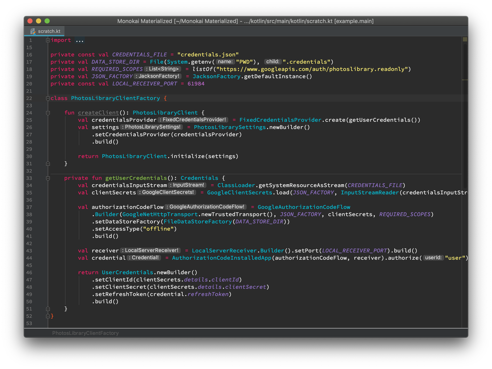
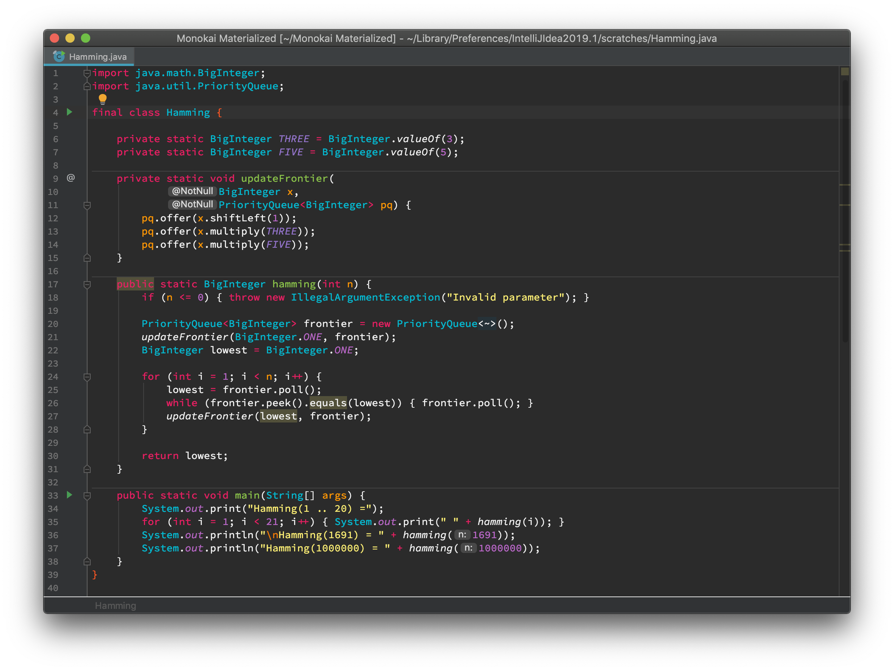
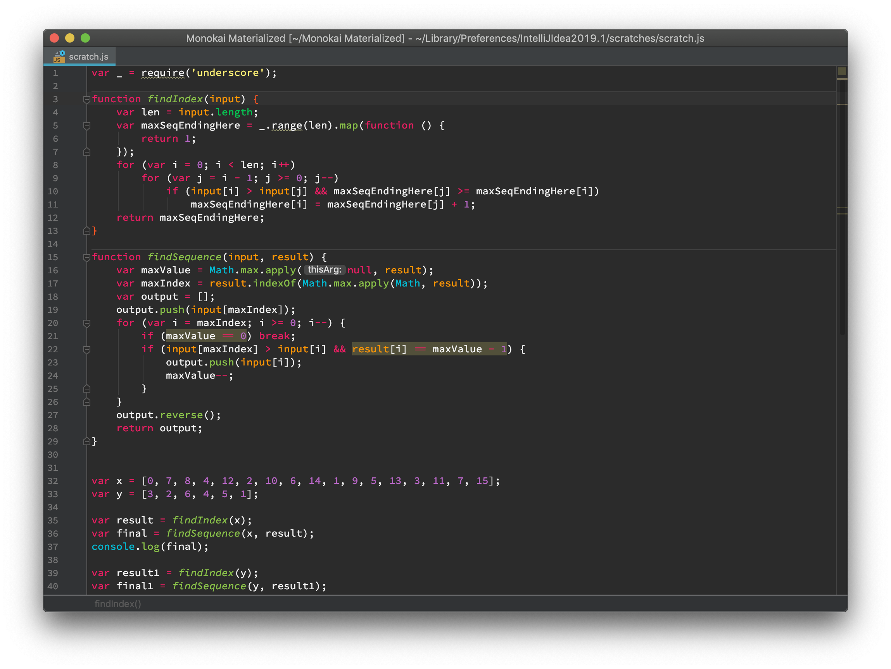
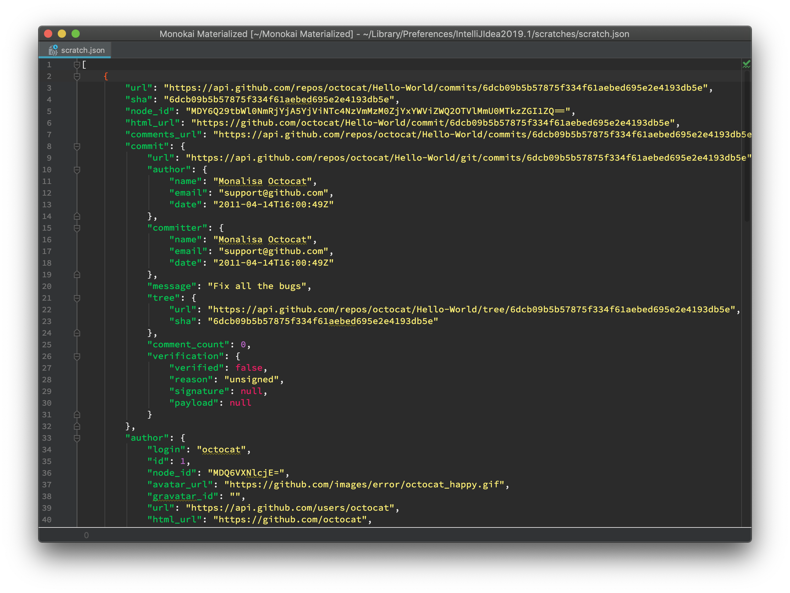
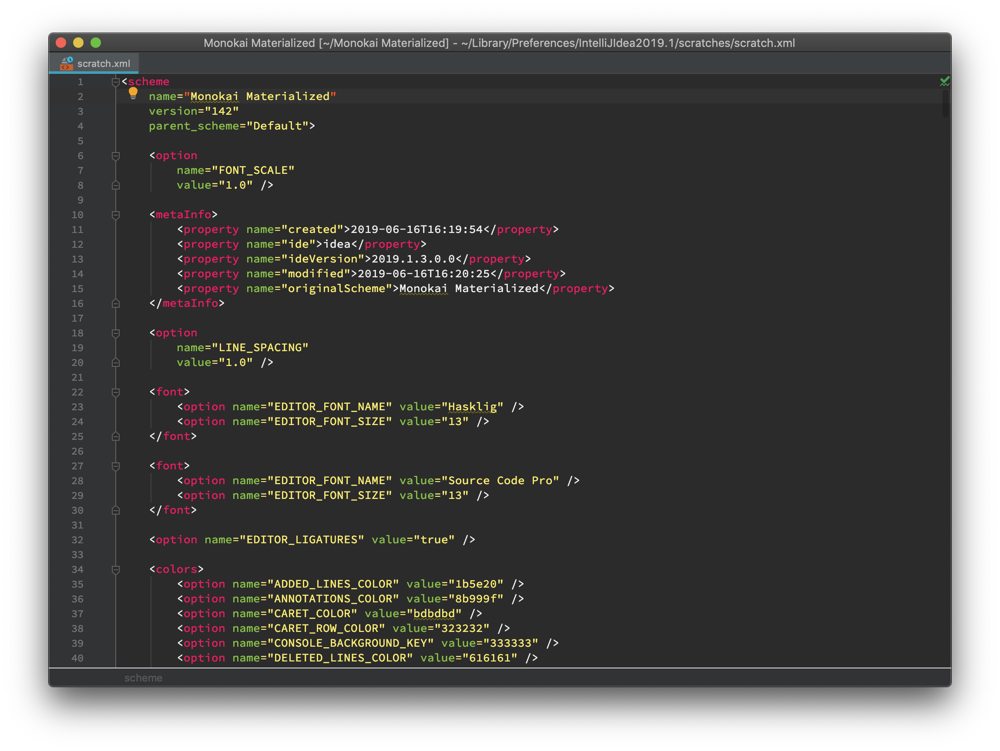

# Monokai Materialized

Color scheme for JetBrains IDEs and Android Studio inspired by [Monokai](https://github.com/monokai), but filled with [Material Design colors](https://material.io/design/color/the-color-system.html#tools-for-picking-colors).

Supports Kotlin, Java, Bash, Dart, Groovy (and Gradle files), TypeScript, HTML, CSS, XML, JSON, Markdown, Python, Diff & Merge, console and more.

## Examples

### Kotlin

### Java

### JavaScript

### Bash

### JSON

### XML

## Installing

### As plugin

Requires IDE restart.

1. Go to "Preferences" -> "Plugins"
2. Select "Marketplace"
3. Search for "Monokai Materialized"
4. Click "Install"

### As color scheme

Doesn't require IDE restart.

1. Download either [Monokai Materialized.jar](Monokai%20Materialized.jar) or [colors/Monokai Materialized.xml](colors/Monokai%20Materialized.xml) (you may need to change extension form `xml` to `.icls`)
2. Go to "Preferences" -> "Editor" -> "Color scheme"
3. Click "cog icon" and select "Import Scheme" and then "Color scheme (.icls) or settings (.jar)"
4. Select downloaded file

## Font

Recommended font for this color scheme is [Hasklig](https://github.com/i-tu/Hasklig).

## License

This project is licensed under the MIT License. See the [LICENSE](LICENSE) file for details.
